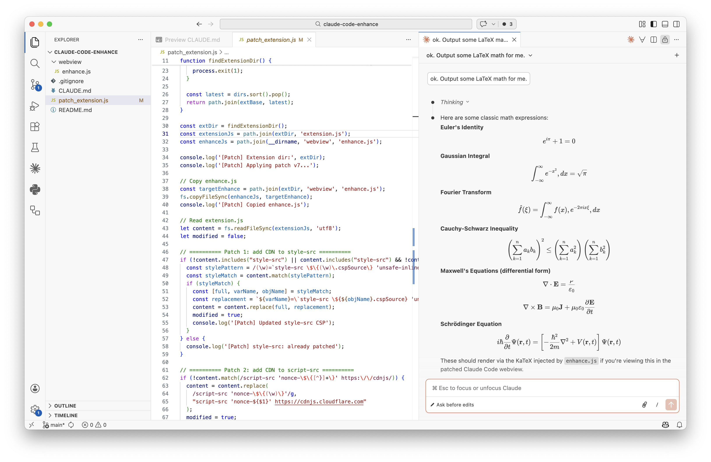
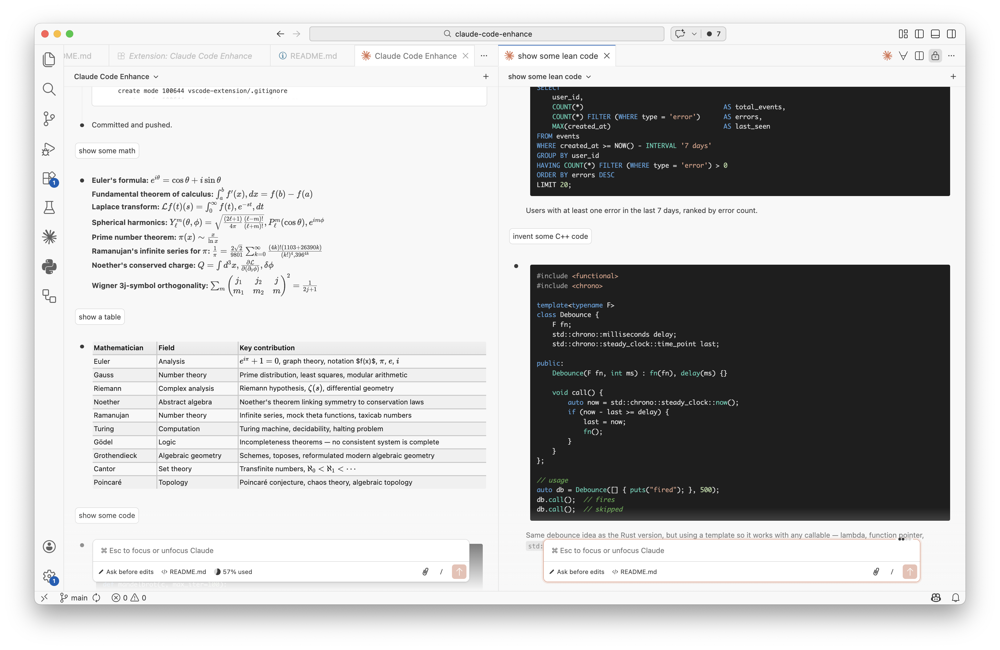

# claude-code-enhance

> Inspired by [Sophomoresty/claude-code-enhance](https://github.com/Sophomoresty/claude-code-enhance).

UI enhancements for the Claude Code VSCode extension:



- **Syntax highlighting** — 180+ languages via Highlight.js
- **LaTeX rendering** — inline and display math via KaTeX
- **Copy button** — copy any AI reply as Markdown
- **Scroll zoom** — `Ctrl+Wheel` to zoom 50–200%
- **Table & list styling** — dark and light theme, hover highlights, proper numbering




## Requirements

- Claude Code extension v2.1.31+

## Installation

### Option A — VSCode extension (recommended)

Install once; patches automatically on startup and after every Claude Code update.

**Build the `.vsix`** (only needed after pulling changes):

```bash
cd vscode-extension
npm install   # only needed once
node build.js
```

**Install into VSCode:**

```bash
code --install-extension vscode-extension/claude-code-enhance-0.2.0.vsix
```

Then reload VSCode (`Ctrl+Shift+P` → `Developer: Reload Window`).

Two commands are available in the Command Palette — only the relevant one is shown at a time:
- **Claude Code Enhance: Apply Patch** — when not yet patched
- **Claude Code Enhance: Restore Original** — when patched

### Option B — run manually

```bash
node patch_extension.js
```

Then reload VSCode. Re-run after every Claude Code extension update.

The script copies `webview/enhance.js` into the extension directory and relaxes the CSP to allow loading from cdnjs.cloudflare.com.

## Features

| Feature | Description |
|---------|-------------|
| Code highlighting | 180+ languages via Highlight.js (theme-aware: dark/light) |
| LaTeX rendering | Inline `$...$`, display `$$...$$`, `\(...\)`, `\[...\]` via KaTeX |
| Copy button | Hover an AI reply to copy it as Markdown (excludes thinking/tool blocks) |
| Scroll zoom | `Ctrl+Wheel` to zoom 50–200%; persisted across sessions |
| Table styling | Dark and light theme with gradient header and hover highlight |
| Code wrapping | Long lines wrap inside code blocks |
| List fix | Numbered lists render without truncation |
| DOM inspector | `Ctrl+Shift+D` copies the page DOM structure to the clipboard |

## How it works

The Claude Code extension renders its UI in a VSCode webview — an isolated iframe with a strict [Content Security Policy](https://developer.mozilla.org/en-US/docs/Web/HTTP/CSP) that blocks external resources by default.

`patch_extension.js` makes five targeted edits to the extension's compiled `extension.js`:

| # | What is patched | Why |
|---|-----------------|-----|
| 1 | `style-src` CSP | allows loading stylesheets from cdnjs.cloudflare.com |
| 2 | `script-src` CSP | allows loading scripts from cdnjs.cloudflare.com |
| 3 | `font-src` CSP | allows KaTeX fonts from cdnjs + inline `data:` URIs |
| 4 | HTML template | injects a `<script>` tag that loads `enhance.js` after the main module |
| 5 | Diff view options | adds `viewColumn: Beside` so diffs open in a side panel instead of full-window |

Once injected, `enhance.js` runs inside the webview on every page load. It uses a two-phase streaming-aware `MutationObserver` — copy buttons are placed immediately (O(1) via incremental turn tracking), while heavier operations (syntax highlighting, LaTeX) run after the stream settles (150 ms via `requestIdleCallback`). Libraries (Highlight.js, KaTeX) are loaded lazily from cdnjs on first use.

## Restoring the original extension

`patch_extension.js` saves a backup of the original `extension.js` as `extension.js.orig` on first run (subsequent runs never overwrite it). To restore:

```bash
node restore_extension.js
```

Then reload VSCode.

## Troubleshooting

- **Features not showing** — reload the VSCode window.
- **Script errors** — verify the CSP was patched correctly in `extension.js`.

## Changelog

### v0.2.0
- Two-phase streaming-aware MutationObserver: immediate O(1) copy button placement + 150ms settle via `requestIdleCallback` for highlight/LaTeX (replaces 500ms debounce)
- Incremental turn tracking — `groupMessagesByTurn()` called once at init; observer maintains state as nodes arrive
- `enhance-done` sentinel class for robust self-exclusion filtering
- Theme-aware syntax highlighting (dark: vs2015, light: vs)
- Rounded borders on highlighted code blocks
- Patch script reads enhance.js version from header comment

### v0.1.0
- VSCode extension wrapper — auto-patches on startup and after Claude Code updates
- Command palette integration (Apply Patch / Restore Original)
- Copy button on AI replies (Markdown export, excludes thinking/tool blocks)
- Light theme support for tables
- Improved variable detection in patch script

### v0.0.x (pre-extension)
- Initial enhancement script with syntax highlighting (Highlight.js), LaTeX rendering (KaTeX), scroll zoom, table/list styling, code wrapping, and DOM inspector
- Manual patching via `node patch_extension.js`
- Backup/restore mechanism for original extension.js
- Diff view opens in side panel

